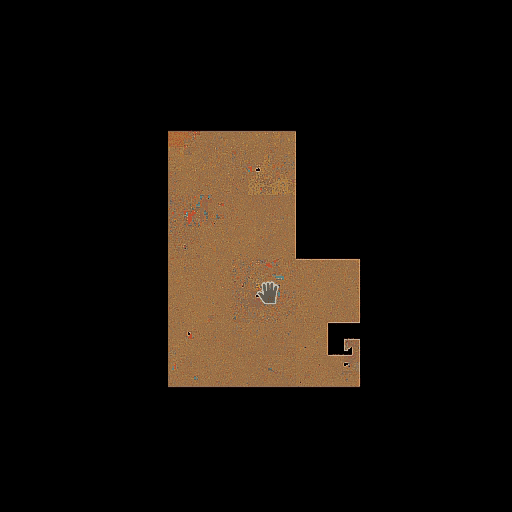
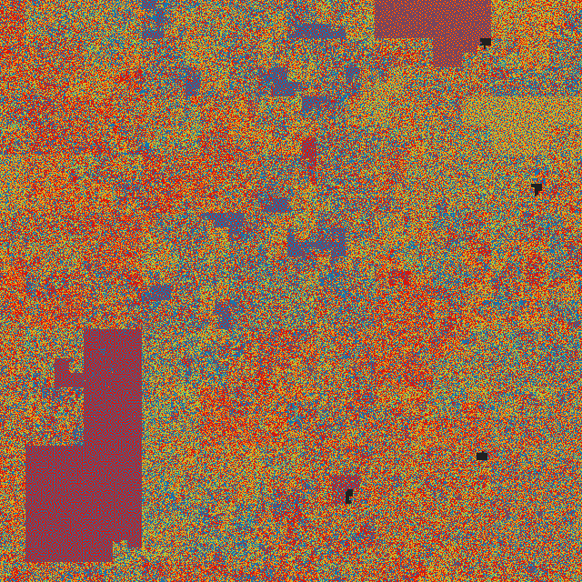

# hilbert-dna

DNA visualization based on hilbert curve.

# why?

The Gilbert curve allows one-dimensional data to be projected into n-dimensional space in such a way that closely spaced data stays close and forms clusters.

In other words, closely located nucleotides in the Gilbert projection are always nearby (but not vice versa - distant nucleotides in the projection are not always distant)

One of the challenges in imaging DNA is the need to display gigantic sequences. An additional dimension allows you to see the whole picture from a bird's eye view not in the form of a "worm" but in the form of a "carpet", which is much clearer.

# About this tool
This tool allows you to turn any linear data of any volume into a two-dimensional giga-picture similar to "google maps". The only limitation is disk space.

The tool sequentially reads the specified files and draws standard 256x256 tiles for them. For visualization, you can use any library for tile maps, the demo uses a <a href="https://leafletjs.com">leaflet</a>.

<a href="https://peko.github.io/hilbert-dna/maps/GCA_015852585.1/index.html">Demo</a>

DNA of Drosophila melanogaster ~167M nucleotides
------------------------------------------------

<a href="https://www.ncbi.nlm.nih.gov/genome/47?genome_assembly_id=1508903">Data sourece</a> Image contains 67M nucleotides.

- [A]denine - Red
- [G]uanine - Green
- [C]ytosine - Orange
- [T]hymine - blue
- [N] - gray

